# Zaino

**Italiano** · [English](README.md)

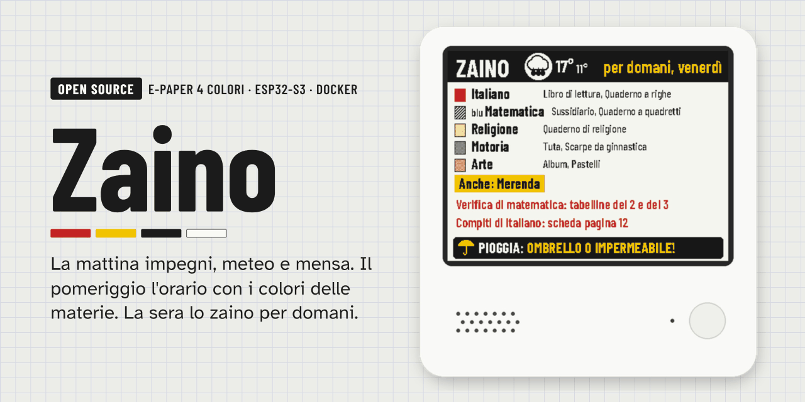

**La dashboard scolastica su carta elettronica a 4 colori.** La mattina mostra gli impegni del giorno, il meteo e cosa c'è in mensa; il pomeriggio l'orario della settimana con i colori delle materie; la sera prima di scuola cosa mettere nello zaino, con l'avviso di prendere l'ombrello se domani piove.

Gira su [ZECTRIX NOTE4C Devkit](https://zectrix.com/en/note4c.html), un display e-paper da 4,2" (nero, bianco, rosso, giallo) con ESP32-S3 e batteria. I dati restano a casa tua: un piccolo server Docker prepara le schermate, il display si sveglia, le scarica e torna a dormire.

## Cosa fa

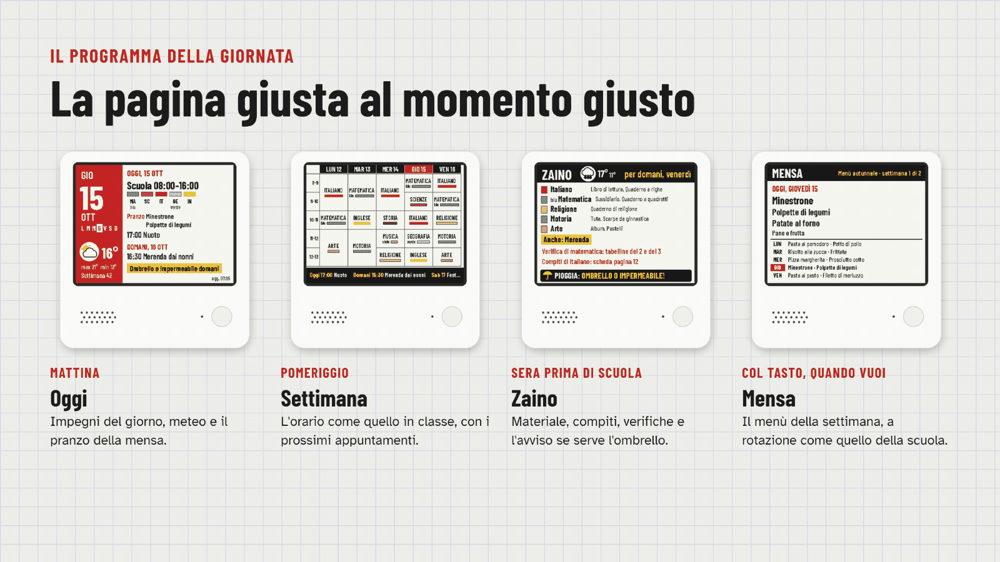

- **Programma della giornata**: scegli quale pagina mostrare in ogni fascia oraria e in quali giorni (giorni di scuola, sera prima di scuola, giorni senza scuola). Di default: la mattina *Oggi*, il pomeriggio *Settimana*, la sera prima di scuola *Zaino*, la notte un'immagine a riposo.
- **Zaino del giorno**: materie in orario, materiale da portare per ciascuna, extra fissi (es. la tuta il martedì), compiti e verifiche dal diario, meteo del giorno e avviso *ombrello o impermeabile*.
- **Orario settimanale** come quello appeso in classe: ore in righe, giorni in colonne, ore uguali unite, ogni materia con la sua linea colorata e, in basso, i prossimi appuntamenti.
- **Mensa**: il menù a rotazione della scuola (per esempio 6 settimane), con il pranzo nella pagina di oggi e una pagina dedicata con tutta la settimana.
- **Colori delle materie**: rosso, giallo e nero sono esatti; arancione, rosa, grigio, bordeaux e oliva si ottengono con il dithering; blu, verde e viola, che il pannello non può mostrare, diventano righe e puntini con il nome del colore scritto in piccolo accanto (disattivabile).
- **Meteo** con previsioni a 3 giorni e consigli pratici: ombrello, giacca pesante, borraccia.
- **Calendari iCal** (sport, attività, famiglia) nella pagina di oggi e sotto l'orario.
- **Immagini a riposo**: galleria di foto convertite a 4 colori, mostrate di notte o nei giorni senza scuola, anche a rotazione.
- **Un colore per ogni figlio**: l'accento del display e della web app può essere rosso, nero o giallo, così con più display in casa si capisce a colpo d'occhio di chi è.
- **Pagine su misura**: attivi le pagine che vuoi, scegli in che ordine le fa scorrere il tasto e per quanti minuti restano visibili.
- **Batteria**: il display dorme quasi sempre, ridisegna solo quando il contenuto cambia e riporta la carica nella web app.
- **Web app** da telefono, installabile sulla schermata Home, per gestire tutto senza toccare file.
- **Italiano e inglese**, per il display e la web app; altre lingue si aggiungono con un file.

## Le pagine

| Oggi | Zaino | Mensa |
|---|---|---|
| 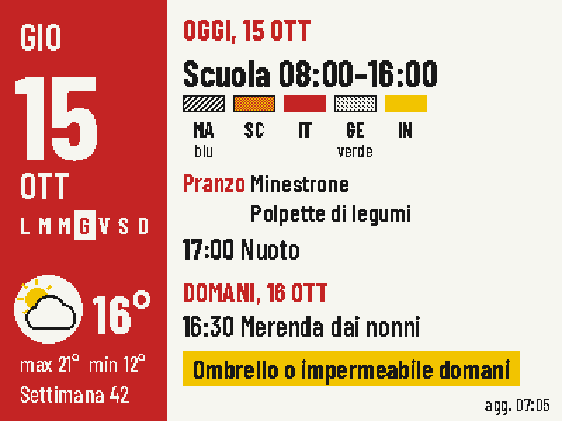 | 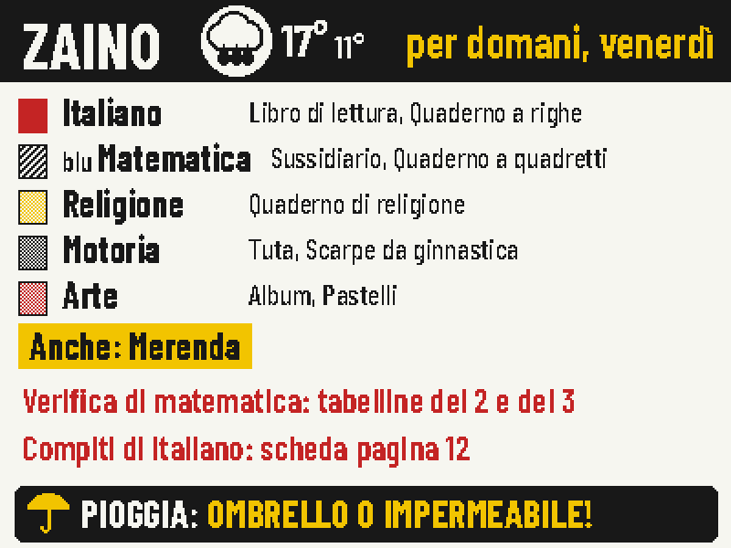 | 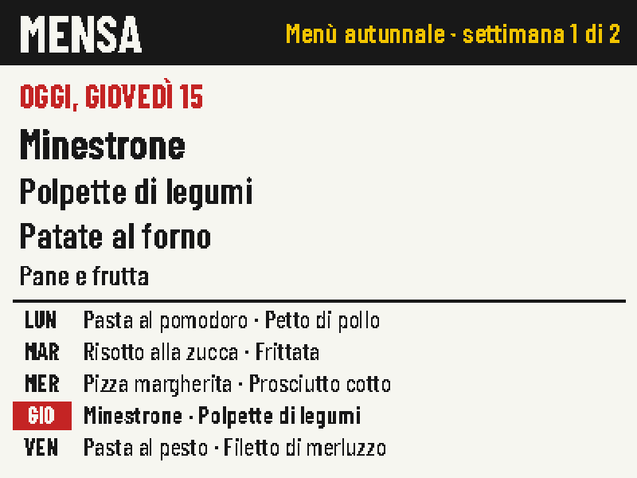 |
| **Settimana** | **Meteo** | **Riposo** |
|  | 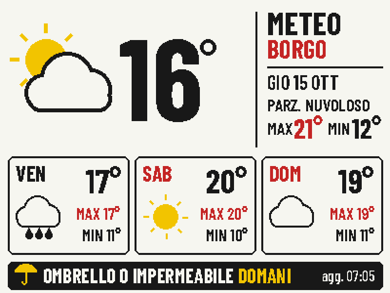 | 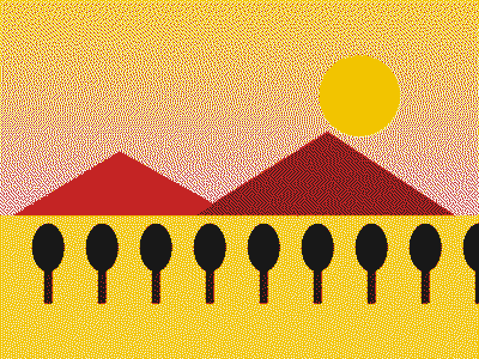 |

Sono le schermate reali generate dal server (400×300, ingrandite 2×), con dati di esempio.

### Un colore per ogni figlio

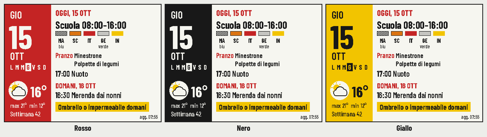

Il colore si sceglie in *Impostazioni → Colore del display*. Cambia la barra laterale di Oggi, le intestazioni di Zaino e Mensa, le fasce in basso di Meteo e Settimana e il colore della web app.

## La web app

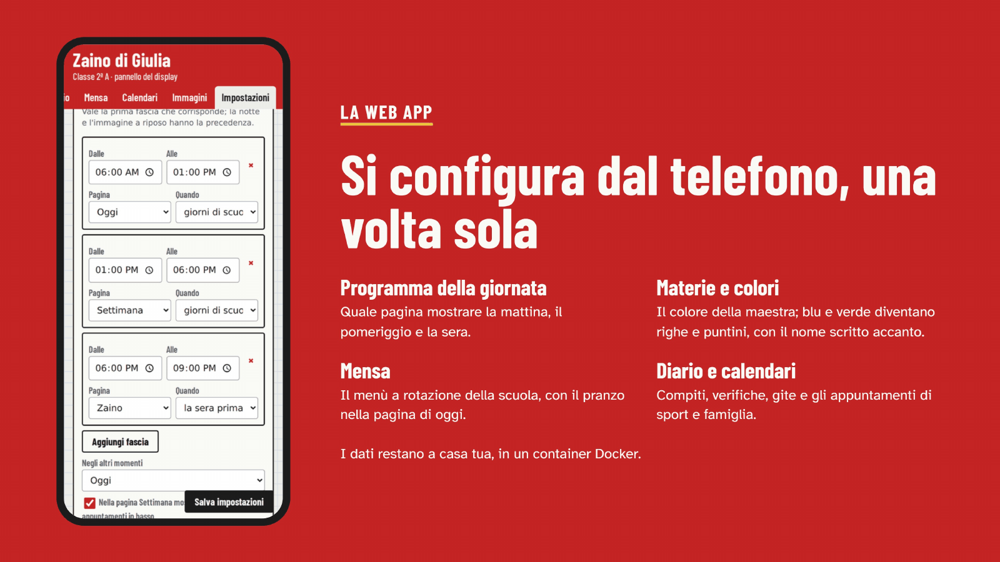

| Schermo | Programma | Materie | Orario |
|---|---|---|---|
| 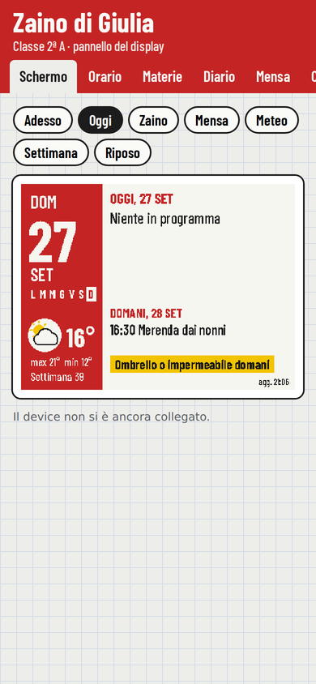 | 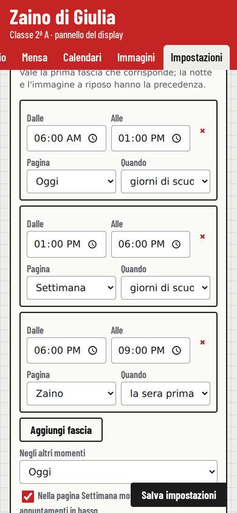 | 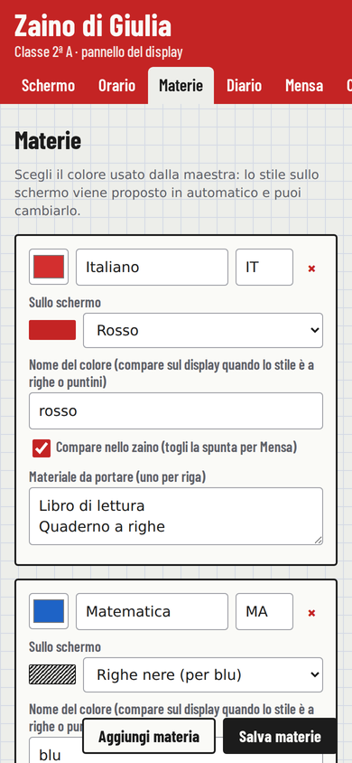 | 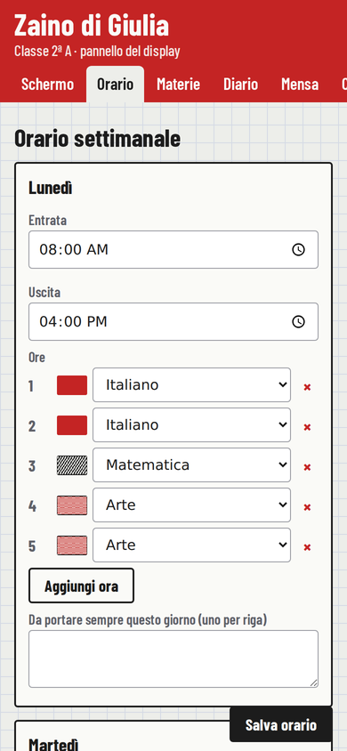 |
| **Mensa** | **Diario** | **Immagini** | |
| 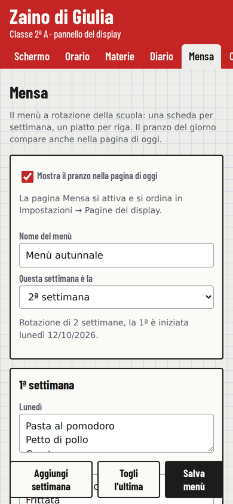 | 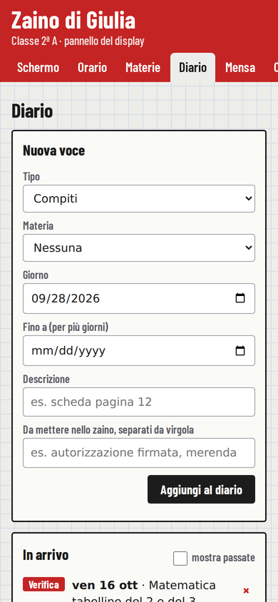 | 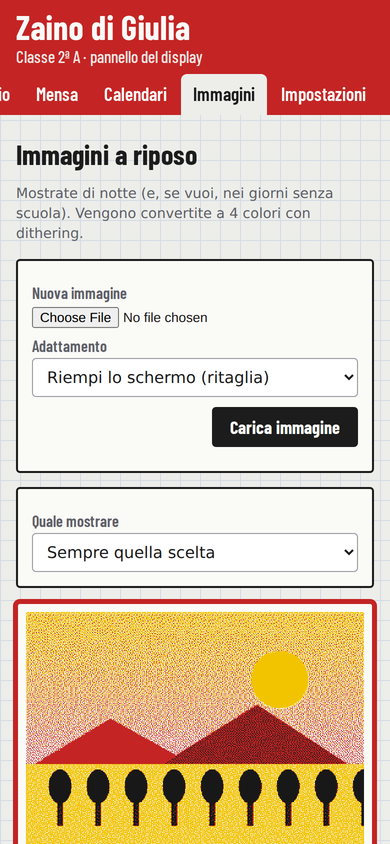 | |

## Come funziona

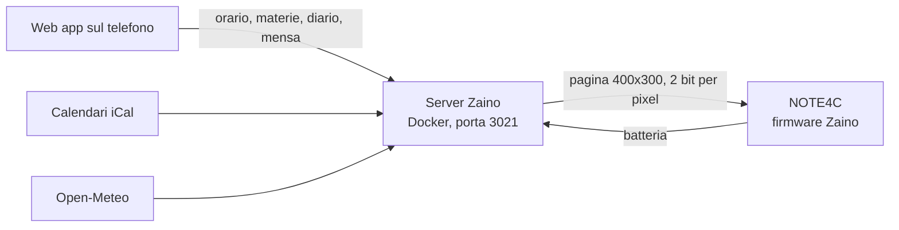

1. Il display si sveglia agli orari impostati e all'inizio e alla fine di ogni fascia del programma, oppure quando premi un tasto.
2. Chiede al server la pagina prevista per quel momento. Se non è cambiato nulla, il server risponde "uguale a prima" e lo schermo non viene ridisegnato.
3. Il server gli dice quanto dormire fino al prossimo appuntamento e il display torna in deep sleep. L'e-paper mantiene l'immagine senza consumare.

**Tasti**: il tasto frontale fa scorrere le pagine attive nell'ordine scelto; dopo il tempo impostato (3 minuti di default) il display torna alla pagina del programma. Il tasto Giù torna subito alla pagina del programma.

## Cosa serve

- Un [NOTE4C Devkit](https://shop.zectrixlab.com/products/note4c-devkit) (ESP32-S3, 16 MB flash, 8 MB PSRAM, 2000 mAh). Il NOTE4 in bianco e nero ha un pannello diverso e non è compatibile.
- Un computer sempre acceso in casa con Docker: un NAS, un Raspberry Pi, un mini PC, un server Proxmox.
- Rete Wi-Fi a 2,4 GHz.
- Chrome o Edge sul computer per installare il firmware dal browser.

## Installazione

La guida completa, passo per passo, è in [docs/installazione.md](docs/installazione.md). In breve:

### 1. Server

```bash
git clone https://github.com/filippocobelli/zaino.git
cd zaino/server
docker compose up -d --build
```

Apri `http://IP-DEL-SERVER:3021/admin`. Con **Portainer**: *Stacks → Add stack → Repository*, URL del repository e percorso `server/docker-compose.yml`.

Vuoi solo curiosare? Avvia il server con `ZAINO_DEMO=1`: meteo ed eventi di esempio, senza configurare nulla.

### 2. Configurazione

Dalla web app: località del meteo (si cerca per nome), materie con i loro colori, orario e materiale, mensa, calendari iCal, programma della giornata e, se vuoi, qualche immagine per la notte.

### 3. Firmware

1. Fai il **backup** della flash del NOTE4C (16 MB).
2. Installa il firmware di riferimento ZECTRIX e collega il display al Wi-Fi: Zaino riusa le credenziali salvate da quel firmware.
3. Compila Zaino con l'indirizzo del tuo server (serve solo Docker):
   ```bash
   cd firmware
   ./build.sh http://192.168.1.50:3021
   ```
4. Installa `zaino-firmware.bin` con il [firmware updater ZECTRIX](https://zectrix.com/en/firmware-updater.html) all'indirizzo `0x0000`, scegliendo di **mantenere le impostazioni**.

Dettagli tecnici: [docs/firmware.md](docs/firmware.md). Endpoint del server: [docs/api.md](docs/api.md).

## Privacy

Orario, nomi, diario e menù restano nel tuo server, in un file JSON. Il server contatta solo Open-Meteo per il meteo e gli indirizzi iCal che inserisci tu. La web app non ha login: tienila nella rete di casa o dietro una VPN (per esempio Tailscale) e non esporla su internet senza un'autenticazione davanti.

## Limiti noti e prossimi passi

- Il firmware non ha ancora una configurazione Wi-Fi propria: per cambiare rete si reinstalla il firmware di riferimento, si configura e si reinstalla Zaino.
- L'orologio interno del display deriva di qualche punto percentuale: per questo dorme al massimo un'ora per volta e ricalcola gli orari a ogni risveglio.
- In programma: una versione **stand-alone** che vive tutta nel display, senza server (configurazione dall'hotspot del display, pensata per chi non ha un server in casa), dettatura del diario, domande vocali, aggiornamenti firmware via Wi-Fi.

## Come è nato

In tutta onestà: non sono un programmatore. Ho tante idee e poche competenze di programmazione, quindi Zaino l'ho realizzato con [Claude](https://claude.ai), l'intelligenza artificiale di Anthropic. Io ho deciso cosa doveva fare, come doveva essere e come doveva comportarsi, e l'ho provato sul display vero e con mio figlio; il codice e la documentazione li ha scritti l'AI. Per me è come rivolgersi a un'azienda di programmazione, solo molto più accessibile.

Non è bastato un prompt: ci sono voluti parecchi tentativi, errori, correzioni e prove sul dispositivo prima che tutto funzionasse insieme.

Se conosci ESP-IDF, FastAPI o l'e-paper meglio di me, revisioni, segnalazioni e pull request sono benvenute.

## Lingue e traduzioni

Il display e la web app sono in **italiano** e in **inglese**: la lingua si sceglie in *Impostazioni → Lingua*.

Vuoi Zaino nella tua lingua? Copia `server/app/lang/en.json`, traducilo e apri una pull request: i passi sono in [docs/tradurre.md](docs/tradurre.md).

## Sostieni il progetto

Zaino è gratuito e open source. Se ti è utile puoi offrirmi un caffè: aiuta a portare avanti la versione stand-alone, tutta nel display, senza server.

[](https://ko-fi.com/filippocobelli)

## Crediti e licenze

- Codice di Zaino: licenza [GNU GPL v3.0 o successiva](LICENSE). Puoi usarlo, modificarlo e condividerlo, anche a fini commerciali, purché mantenga i crediti e pubblichi le tue modifiche con la stessa licenza.
- La sequenza di pilotaggio del pannello SSD2683 deriva dal [firmware di riferimento NOTE4C](https://github.com/LazyYoun/youn-ink-fourcolor-firmware) (MIT, avviso in [THIRD_PARTY_NOTICES.md](THIRD_PARTY_NOTICES.md)).
- Font [Barlow Condensed](https://fonts.google.com/specimen/Barlow+Condensed), SIL Open Font License (`server/app/fonts/OFL.txt`).
- Dati meteo di [Open-Meteo.com](https://open-meteo.com/) (CC BY 4.0). L'API gratuita di Open-Meteo è per uso non commerciale.
- Codice, documentazione e immagini realizzati con [Claude](https://claude.ai) di Anthropic (vedi [Come è nato](#come-è-nato)).

Zaino è un progetto indipendente, non affiliato a ZECTRIX. Il NOTE4C Devkit è hardware di sviluppo: installare firmware personalizzati è a tuo rischio, e conviene sempre avere un backup della flash.
