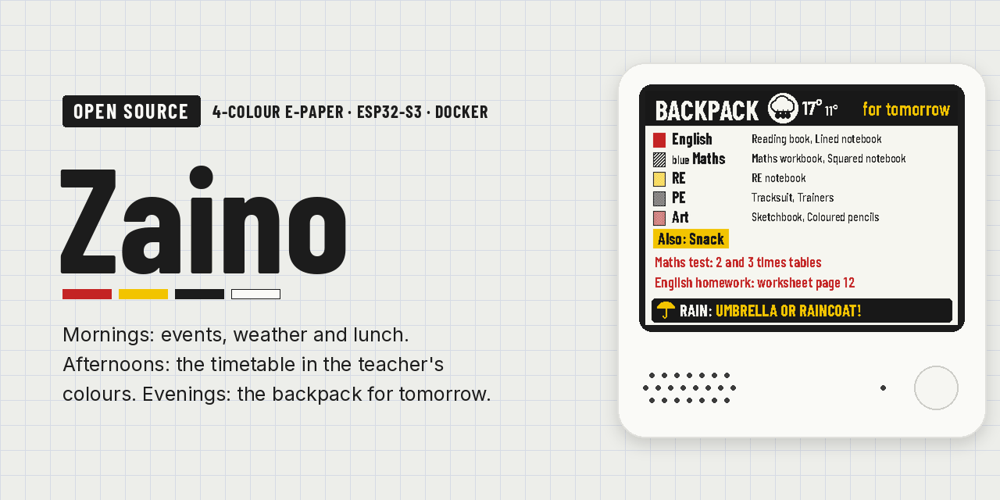
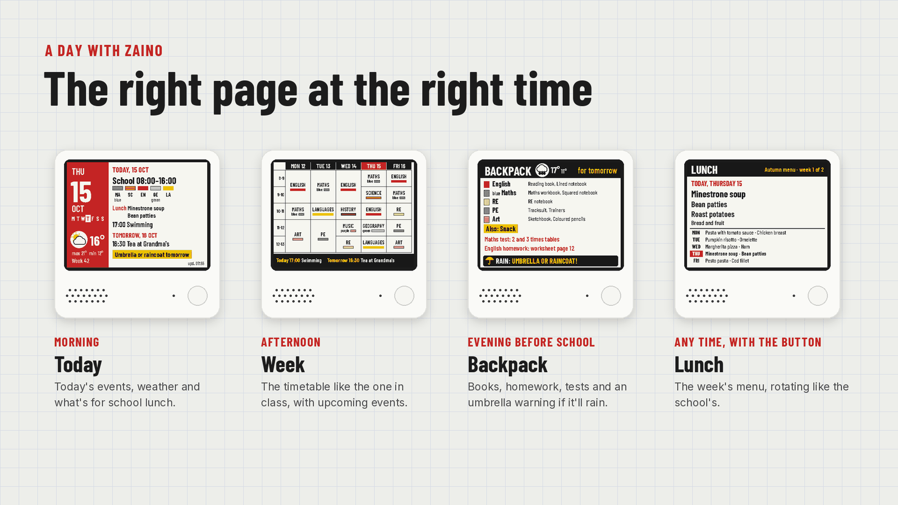
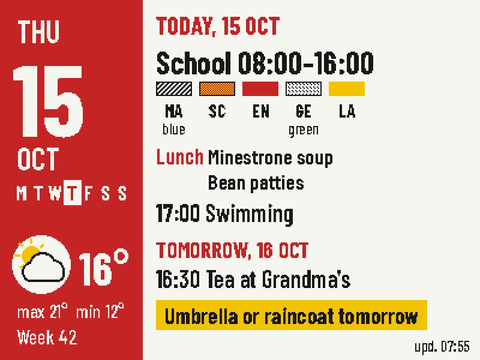
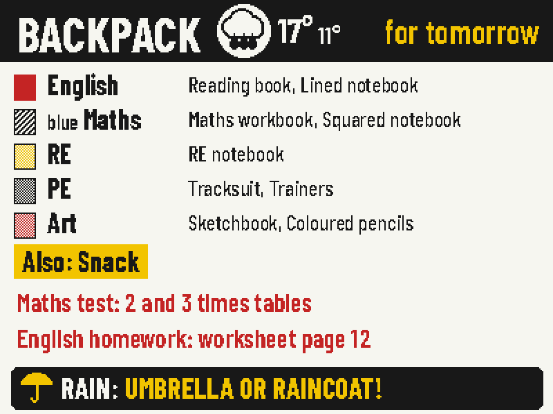
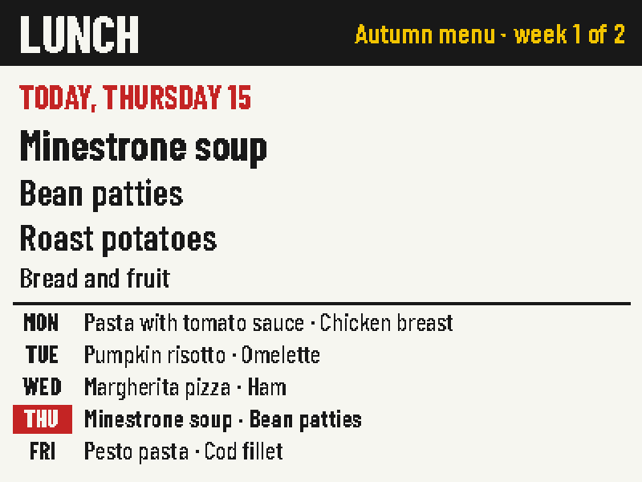
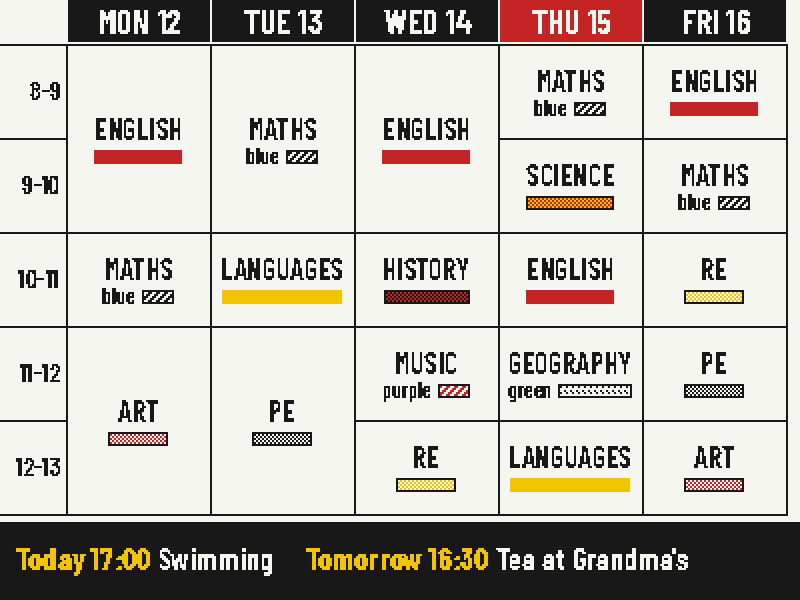
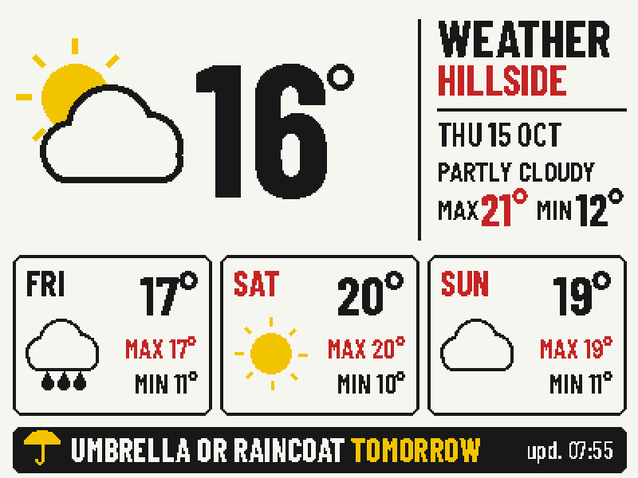
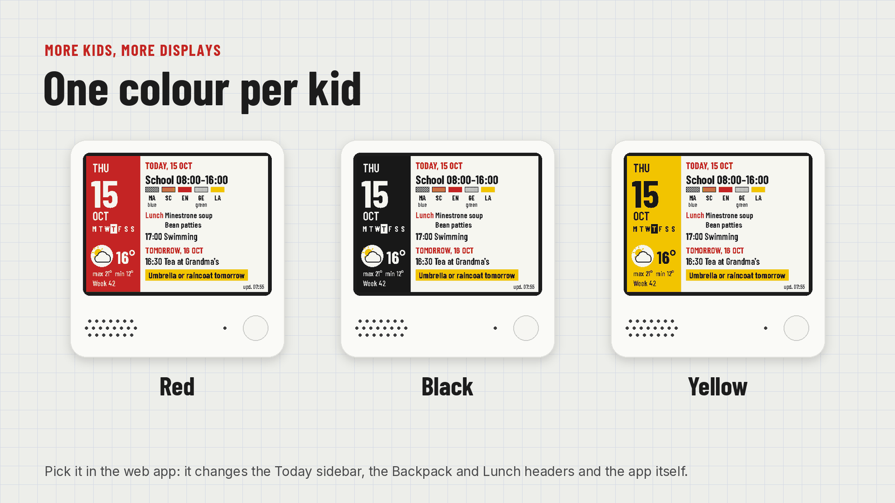
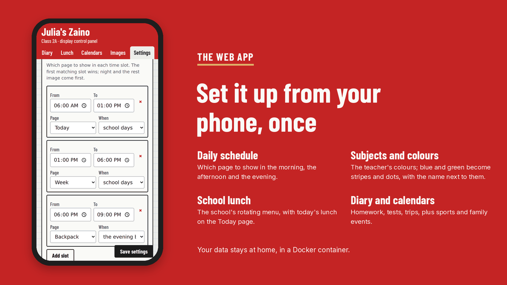
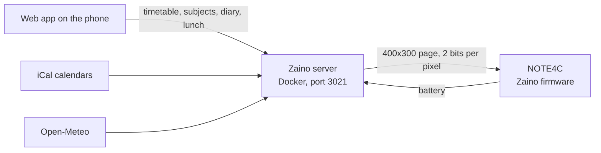

# Zaino

[Italiano](README.it.md) · **English**



**A school dashboard on 4-colour e-paper.** In the morning it shows the day's events, the weather and what's for school lunch; in the afternoon the weekly timetable in the teacher's colours; the evening before school what goes in the backpack, with an umbrella warning if it's going to rain tomorrow.

It runs on the [ZECTRIX NOTE4C Devkit](https://zectrix.com/en/note4c.html), a 4.2" e-paper display (black, white, red, yellow) with an ESP32-S3 and a battery. Your data stays at home: a small Docker server draws the pages, the display wakes up, downloads them and goes back to sleep.

*Zaino* is Italian for "backpack".

## What it does



- **Daily schedule**: pick which page to show in each time slot and on which days (school days, the evening before school, days without school). By default: *Today* in the morning, *Week* in the afternoon, *Backpack* the evening before school, a rest image at night.
- **Backpack**: the day's subjects, what to bring for each, fixed extras (e.g. PE kit on Tuesdays), homework and tests from the diary, the weather and an *umbrella or raincoat* warning.
- **Weekly timetable** like the one on the classroom wall: lessons in rows, days in columns, repeated lessons merged, each subject with its coloured line and upcoming events at the bottom.
- **School lunch**: the school's rotating menu (e.g. 6 weeks), with today's lunch on the Today page and a page with the whole week.
- **Subject colours**: red, yellow and black are exact; orange, pink, grey, burgundy and olive are dithered; blue, green and purple, which the panel can't show, become stripes and dots with the colour name written next to them (optional).
- **Weather** with a 3-day forecast and practical tips: umbrella, warm coat, water bottle.
- **iCal calendars** (sports, activities, family) on the Today page and under the timetable.
- **Rest images**: a gallery of photos converted to 4 colours, shown at night or on days without school, also in rotation.
- **One colour per kid**: the accent of the display and of the web app can be red, black or yellow, so with more than one display at home you can tell at a glance whose it is.
- **Your pages**: turn on the pages you want, pick the order the button cycles through them and how long they stay on screen.
- **Battery friendly**: the display sleeps almost all the time, redraws only when the content changes and reports its charge to the web app.
- **Phone web app**, installable on the Home screen, to manage everything without touching files.
- **Italian and English**, for the display and the web app; more languages can be added with one file.

## The pages

| Today | Backpack | Lunch |
|---|---|---|
|  |  |  |
| **Week** | **Weather** | **Rest** |
|  |  |  |

These are the real screens drawn by the server (400×300, enlarged 2×), with sample data.

### One colour per kid



The colour is picked in *Settings → Display colour*. It changes the sidebar of Today, the headers of Backpack and Lunch, the bottom bars of Weather and Week and the colour of the web app.

## The web app



## How it works



1. The display wakes up at the set times, at the start and end of each slot of the daily schedule, or when you press a button.
2. It asks the server for the page due at that moment. If nothing changed, the server answers "same as before" and the screen isn't redrawn.
3. The server tells it how long to sleep until the next wake-up, and the display goes back to deep sleep. E-paper keeps the image without using power.

**Buttons**: the front button cycles through the active pages in the chosen order; after the set time (3 minutes by default) the display goes back to the scheduled page. The Down button goes back to it straight away.

## What you need

- A [NOTE4C Devkit](https://shop.zectrixlab.com/products/note4c-devkit) (ESP32-S3, 16 MB flash, 8 MB PSRAM, 2000 mAh). The black-and-white NOTE4 has a different panel and isn't compatible.
- An always-on computer at home with Docker: a NAS, a Raspberry Pi, a mini PC, a Proxmox server.
- A 2.4 GHz Wi-Fi network.
- Chrome or Edge on your computer to install the firmware from the browser.

## Installation

The full step-by-step guide is in [docs/installazione.md](docs/installazione.md) (in Italian for now). In short:

### 1. Server

```bash
git clone https://github.com/filippocobelli/zaino.git
cd zaino/server
docker compose up -d --build
```

Open `http://SERVER-IP:3021/admin`. With **Portainer**: *Stacks → Add stack → Repository*, the repository URL and the path `server/docker-compose.yml`.

For a new install in English, uncomment `ZAINO_LANG=en` in `server/docker-compose.yml` before the first start: the example subjects will be in English too. The language can be changed at any time in *Settings → Language*.

Just want to look around? Start the server with `ZAINO_DEMO=1`: sample weather and events, nothing to configure.

### 2. Setup

From the web app: weather location (search by name), subjects and their colours, timetable and things to bring, school lunch, iCal calendars, daily schedule and, if you like, a few images for the night.

### 3. Firmware

1. **Back up** the NOTE4C flash (16 MB).
2. Install the ZECTRIX reference firmware and connect the display to Wi-Fi: Zaino reuses the credentials saved by that firmware.
3. Build Zaino with your server's address (only Docker is needed):
   ```bash
   cd firmware
   ./build.sh http://192.168.1.50:3021
   ```
4. Install `zaino-firmware.bin` with the [ZECTRIX firmware updater](https://zectrix.com/en/firmware-updater.html) at address `0x0000`, choosing to **keep the settings**.

Technical details: [docs/firmware.md](docs/firmware.md). Server endpoints: [docs/api.md](docs/api.md).

## Privacy

Timetable, names, diary and menu stay on your server, in a JSON file. The server only contacts Open-Meteo for the weather and the iCal addresses you add. The web app has no login: keep it on your home network or behind a VPN (e.g. Tailscale) and don't expose it to the internet without authentication in front of it.

## Known limits and next steps

- The firmware doesn't have its own Wi-Fi setup yet: to change network you reinstall the reference firmware, configure it and reinstall Zaino.
- The display's internal clock drifts by a few percent: that's why it sleeps at most one hour at a time and recalculates the times at every wake-up.
- Planned: a **stand-alone** version that lives entirely on the display, with no server (setup from the display's hotspot, for people without a server at home), diary dictation, voice questions, over-the-air firmware updates.

## How it was built

Full honesty: I'm not a programmer. I have plenty of ideas and very little coding skill, so Zaino was built with [Claude](https://claude.ai), Anthropic's AI. I decided what it should do and how it should look and behave, and I tested it on the real display and with my kid; the AI wrote the code and the documentation. To me it's like hiring a software company, just far more accessible.

It wasn't a one-prompt job: it took a good deal of trial and error, many iterations and plenty of tests on the real device before everything worked together.

If you know ESP-IDF, FastAPI or e-paper better than I do, reviews, issues and pull requests are very welcome.

## Languages and translations

The display and the web app are in **Italian** and **English**: pick the language in *Settings → Language*.

Want Zaino in your language? Copy `server/app/lang/en.json`, translate it and open a pull request: the steps are in [docs/tradurre.md](docs/tradurre.md).

## Support the project

Zaino is free and open source. If it's useful to you, you can buy me a coffee: it helps build the stand-alone version, running entirely on the display with no server.

[](https://ko-fi.com/filippocobelli)

## Credits and licences

- Zaino's code: [GNU GPL v3.0 or later](LICENSE). You can use, modify and share it, even commercially, as long as you keep the credits and release your changes under the same licence.
- The SSD2683 panel driving sequence comes from the [NOTE4C reference firmware](https://github.com/LazyYoun/youn-ink-fourcolor-firmware) (MIT, notice in [THIRD_PARTY_NOTICES.md](THIRD_PARTY_NOTICES.md)).
- [Barlow Condensed](https://fonts.google.com/specimen/Barlow+Condensed) font, SIL Open Font License (`server/app/fonts/OFL.txt`).
- Weather data from [Open-Meteo.com](https://open-meteo.com/) (CC BY 4.0). Open-Meteo's free API is for non-commercial use.
- Code, documentation and images written with [Claude](https://claude.ai) by Anthropic (see [How it was built](#how-it-was-built)).

Zaino is an independent project, not affiliated with ZECTRIX. The NOTE4C Devkit is development hardware: installing custom firmware is at your own risk, and it's always wise to keep a backup of the flash.
